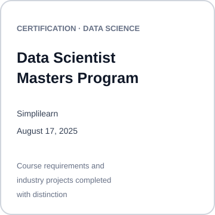
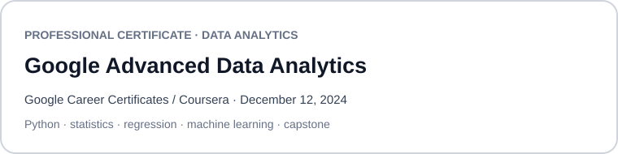
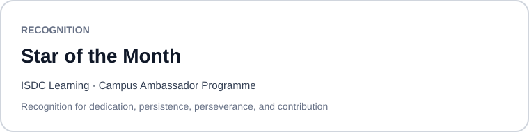
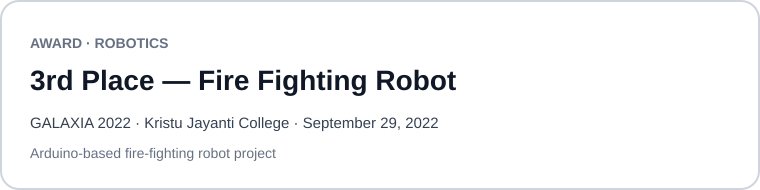
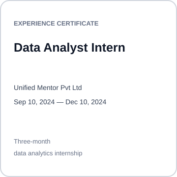

<strong>Denos Kume</strong>

 

<h1 align="center">Certifications & Awards</h1>

Selected credentials, awards, and experience evidence supporting my work in Data Science, Machine Learning, Computer Vision, and engineering.

This repository is intentionally selective: it highlights only credentials and achievements that materially strengthen my technical profile.

## Featured Credentials

  
  

## Recognition & Award

  
  

## Experience Evidence

  

## Selection Policy

Not every completed course is included here. Introductory or overlapping certificates are intentionally omitted when stronger academic work, professional experience, or project evidence already demonstrates the same skill.

For current engineering work, see my main GitHub profile: [github.com/denoskume](https://github.com/denoskume)

## Document Notice

Credential and award documents remain the property of their respective issuers. They are published here only as evidence of credentials and achievements.
